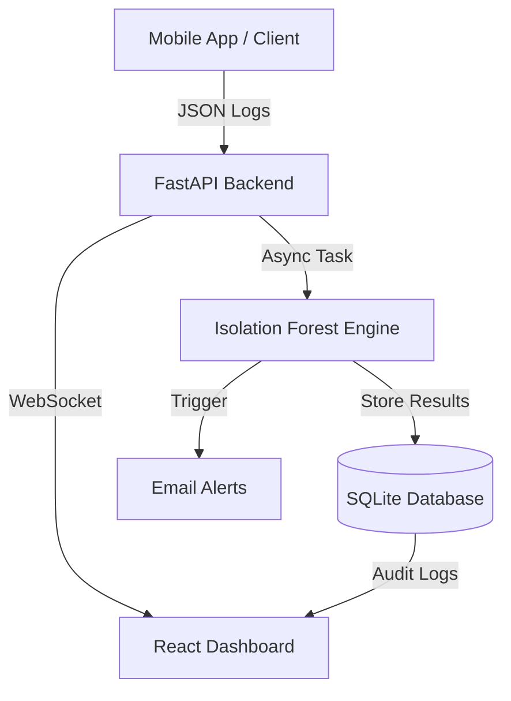

# 🛡️ Mobile API Misuse Detector

[](https://opensource.org/licenses/MIT)
[](https://fastapi.tiangolo.com/)
[](https://reactjs.org/)
[](https://scikit-learn.org/)

An advanced, **Active-Security Platform** designed to detect and mitigate API abuse in mobile environments using unsupervised Machine Learning.

---

## 🏗️ System Architecture
The platform utilizes a modern decoupled architecture to ensure low-latency analysis and real-time response.




### Key Components:
- **FastAPI Backend**: Handles asynchronous log parsing and ML inference.
- **Isolation Forest Engine**: Detects zero-day anomalies without predefined signatures.
- **Persistent Storage**: SQLite database for audit trails, alert history, and dynamic settings.
- **Glassmorphism UI**: A premium React dashboard for real-time monitoring.

---

## ✨ Key Features
- **🚀 Real-time Ingestion**: Support for Nginx, Express, and Spring log formats.
- **🤖 AI-Powered Detection**: Unsupervised anomaly detection using `IsolationForest`.
- **📊 Behavioral Clustering**: Groups suspicious IPs by attack patterns (Bruteforce, Scrapers, Spikes).
- **🔔 Active Alerting**: Automated Email/Webhook notifications via background tasks.
- **⚙️ Dynamic Thresholds**: Adjust sensitivity on-the-fly via the administrative dashboard.
- **📜 Audit Logs**: Full persistence of every alert and system setting change.

---

## 📸 UI Showcase

| Dashboard Overview | Anomaly Analytics |
|:---:|:---:|
|  |  |
| *Real-time visibility of system health.* | *Visualizing anomaly scores and patterns.* |

| Log Ingestion | Alert Journal |
|:---:|:---:|
|  |  |
| *Seamless drag-and-drop log analysis.* | *Complete history of security incidents.* |

| Email Notifications | Security Recommendations |
|:---:|:---:|
|  |  |
| *Immediate alerts for critical threats.* | *Actionable AI-driven mitigation steps.* |

---


## 🛠️ Installation & Setup

### 1. Prerequisites
- Python 3.9+
- Node.js 18+
- SMTP Server (e.g., Gmail) for alerts.

### 2. Backend Setup
```bash
cd backend
python -m venv .venv
source .venv/bin/activate  # On Windows: .venv\Scripts\activate
pip install -r requirements.txt
```

### 3. Frontend Setup
```bash
cd frontend
npm install
```

### 4. Configuration
Create a `.env` file in the root directory:
```env
SMTP_USERNAME=your-email@gmail.com
SMTP_PASSWORD=your-app-password
EMAIL_FROM=your-email@gmail.com
EMAIL_TO=admin@example.com
```

### 5. Run the Application
**Backend:**
```bash
uvicorn backend.main:app --reload
```
**Frontend:**
```bash
npm run dev
```

---

## 📡 API Endpoints
- `POST /upload-log`: Ingest and analyze log files.
- `GET /stats`: Retrieve enriched metrics for the dashboard.
- `GET /alerts/history`: Access the persistent security audit trail.
- `POST /settings`: Configure alert thresholds and system state.

---

## 📄 Academic Research
This project is part of a comprehensive security study. A detailed **14-page scientific report** following the **SoftwareX (Elsevier)** template is available as `report.tex` in the root directory.

---

## 👥 Contributors
- **Kaoutar Menacera**
- **Ayoub Laafar**

---
*Developed with ❤️ for the DevSecOps Community.*
