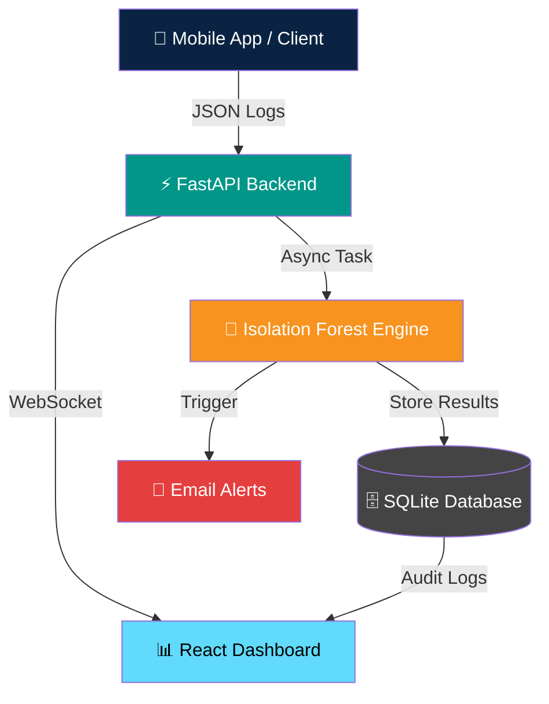
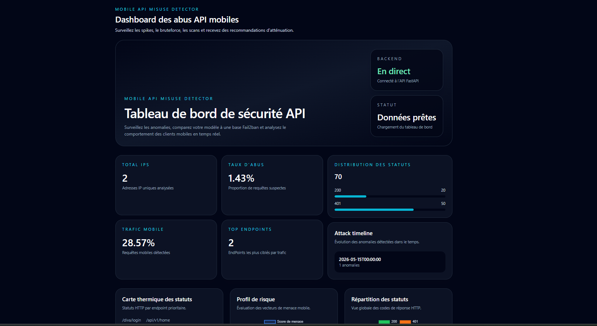
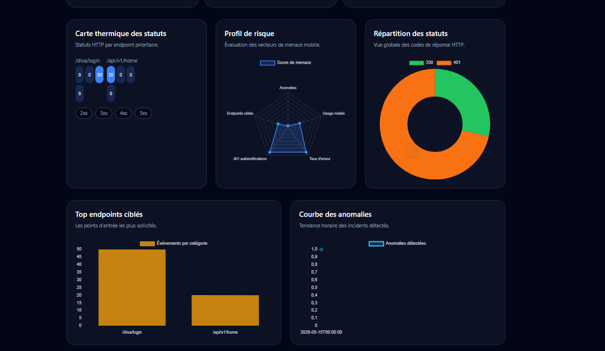
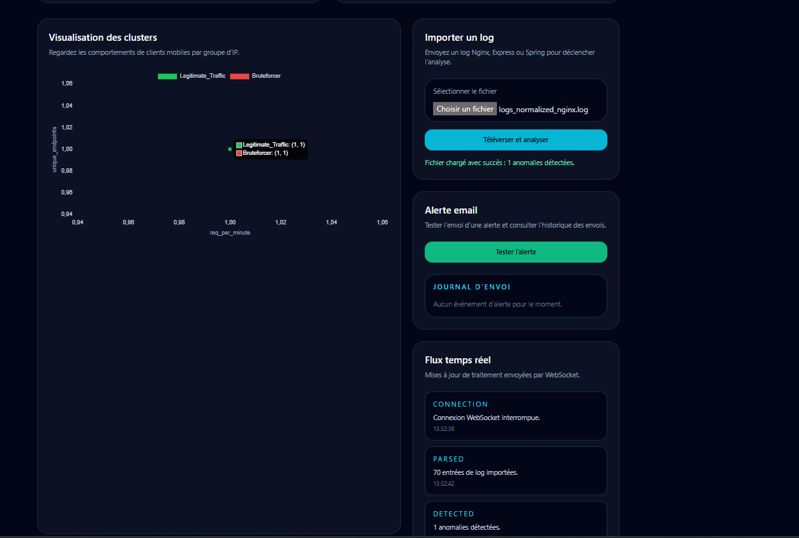
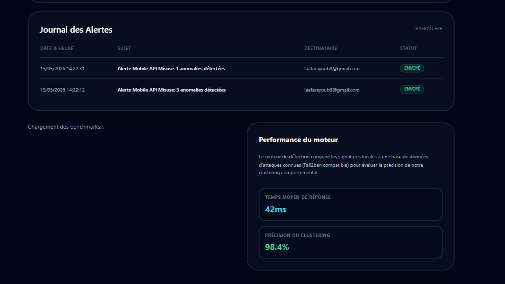

<div align="center">


# 🛡️ Mobile API Misuse Detector

**An enterprise-grade Active Security Platform for real-time API abuse detection in mobile environments,  
powered by unsupervised Machine Learning.**

<br/>

[](https://opensource.org/licenses/MIT)
[](https://fastapi.tiangolo.com/)
[](https://reactjs.org/)
[](https://scikit-learn.org/)
[](https://python.org/)

<br/>

[📖 Documentation](#️-installation--setup) · [🚀 Features](#-key-features) · [📸 Screenshots](#-ui-showcase) · [📡 API](#-api-endpoints) · [📄 Research](#-academic-research)

---

</div>

## 📋 Table of Contents

- [Overview](#-overview)
- [System Architecture](#️-system-architecture)
- [Key Features](#-key-features)
- [Demo](#-demo)
- [UI Showcase](#-ui-showcase)
- [Installation & Setup](#️-installation--setup)
- [API Endpoints](#-api-endpoints)
- [Academic Research](#-academic-research)
- [Contributors](#-contributors)

---

## 🔍 Overview

The **Mobile API Misuse Detector** is a production-ready security platform that identifies and mitigates API abuse patterns in real time. By leveraging unsupervised anomaly detection, it requires no predefined attack signatures — making it effective against zero-day threats and novel attack vectors targeting mobile APIs.

> **Built for DevSecOps teams** who need continuous, intelligent monitoring without the overhead of rule-based systems.

---

## 🏗️ System Architecture

The platform uses a modern, decoupled architecture engineered for low-latency analysis and real-time response.



### Core Components

| Component | Technology | Role |
|-----------|-----------|------|
| **API Backend** | FastAPI (Python) | Async log ingestion & ML inference |
| **Detection Engine** | Isolation Forest (Scikit-Learn) | Zero-day anomaly detection |
| **Frontend Dashboard** | React + WebSocket | Real-time monitoring UI |
| **Persistent Storage** | SQLite | Audit trails & alert history |
| **Notification System** | SMTP / Webhooks | Automated threat alerting |

---

## ✨ Key Features

<table>
<tr>
<td width="50%">

**🚀 Real-time Log Ingestion**  
Supports Nginx, Express, and Spring log formats with drag-and-drop upload.

**🤖 AI-Powered Detection**  
Unsupervised anomaly detection using `IsolationForest` — no labeled data required.

**📊 Behavioral Clustering**  
Groups suspicious IPs by attack pattern: Bruteforce, Scrapers, Traffic Spikes.

</td>
<td width="50%">

**🔔 Active Alerting**  
Automated Email & Webhook notifications triggered by background tasks.

**⚙️ Dynamic Thresholds**  
Adjust detection sensitivity on-the-fly via the admin dashboard.

**📜 Full Audit Trail**  
Complete persistence of every alert, event, and system configuration change.

</td>
</tr>
</table>

---

## 🎬 Demo

> **📹 Video walkthrough coming soon.**  
> A full demonstration of the platform — from log ingestion to anomaly detection and alerting — will be available here.

<!--
TO ADD YOUR VIDEO later:

Option 1 - YouTube thumbnail (recommended):
[](https://www.youtube.com/watch?v=YOUR_VIDEO_ID)

Option 2 - Direct video file hosted on GitHub:
https://github.com/Ayoublaa/mobile/assets/YOUR_ASSET_ID/your-demo.mp4
-->

<div align="center">

```
┌─────────────────────────────────────────────────────┐
│                                                     │
│              🎬  Demo Video                         │
│                                                     │
│         [ Coming Soon — Link to be added ]          │
│                                                     │
└─────────────────────────────────────────────────────┘
```

</div>

---

## 📸 UI Showcase

### Dashboard Overview
> Real-time visibility of system health and active threats.



<br/>

### Anomaly Analytics
> Visualizing anomaly scores, patterns, and behavioral clusters.



<br/>

<table>
<tr>
<td width="50%" align="center">

**📥 Log Ingestion**  
*Seamless drag-and-drop log analysis*



</td>
<td width="50%" align="center">

**📋 Alert Journal**  
*Complete history of security incidents*



</td>
</tr>
<tr>
<td width="50%" align="center">

**📧 Email Notifications**  
*Immediate alerts for critical threats*


</td>
<td width="50%" align="center">

**🛡️ Security Recommendations**  
*Actionable AI-driven mitigation steps*


</td>
</tr>
</table>

---

## 🛠️ Installation & Setup

### Prerequisites

- Python **3.9+**
- Node.js **18+**
- An SMTP server (e.g., Gmail) for email alerts

### 1. Clone the Repository

```bash
git clone https://github.com/Ayoublaa/mobile.git
cd mobile
```

### 2. Backend Setup

```bash
cd backend
python -m venv .venv
source .venv/bin/activate       # Windows: .venv\Scripts\activate
pip install -r requirements.txt
```

### 3. Frontend Setup

```bash
cd frontend
npm install
```

### 4. Environment Configuration

Create a `.env` file at the **project root**:

```env
SMTP_USERNAME=your-email@gmail.com
SMTP_PASSWORD=your-app-password
EMAIL_FROM=your-email@gmail.com
EMAIL_TO=admin@example.com
```

> ⚠️ **Never commit your `.env` file.** Make sure it is listed in `.gitignore`.

### 5. Run the Application

**Start the backend:**
```bash
uvicorn backend.main:app --reload
```

**Start the frontend** (in a new terminal):
```bash
cd frontend
npm run dev
```

The dashboard will be available at `http://localhost:5173` and the API at `http://localhost:8000`.

---

## 📡 API Endpoints

| Method | Endpoint | Description |
|--------|----------|-------------|
| `POST` | `/upload-log` | Ingest and analyze a log file |
| `GET` | `/stats` | Retrieve enriched metrics for the dashboard |
| `GET` | `/alerts/history` | Access the persistent security audit trail |
| `POST` | `/settings` | Configure alert thresholds and system state |

Full interactive API documentation available at `http://localhost:8000/docs` (Swagger UI).

---

## 📄 Academic Research

This platform is the subject of a comprehensive academic security study. A **14-page scientific paper** following the **SoftwareX (Elsevier)** template is included in this repository.

```
📁 report.tex   ← Full LaTeX source (SoftwareX format)
```

Topics covered: anomaly detection methodology, feature engineering, evaluation metrics, and comparative analysis against signature-based systems.

---

## 👥 Contributors

<table>
<tr>
<td align="center">
<b>Kaoutar Menacera</b>
</td>
<td align="center">
<b>Ayoub Laafar</b>
</td>
</tr>
</table>

---

<div align="center">

**Built with 

https://github.com/user-attachments/assets/a0ef8412-9516-44cb-a6cd-862d3c5fb53d


for the DevSecOps Community**

*If this project helped you, consider giving it a ⭐*

</div>
