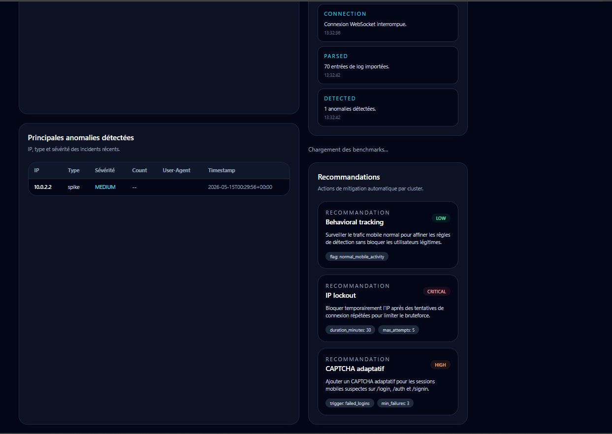
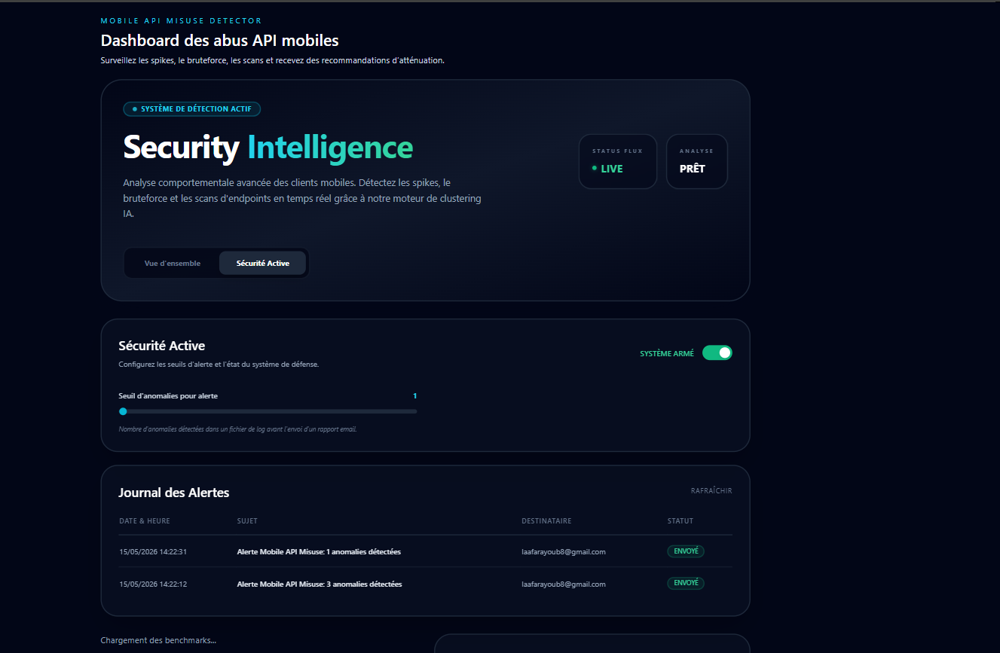

# Rapport de Projet : Mobile API Misuse Detector

**Auteurs :** Kaoutar Menacera & Ayoub Laafar
**Institution :** Faculté des Sciences, Département d'Informatique

## Résumé
Mobile API Misuse Detector est un outil conçu pour surveiller et sécuriser les interfaces de programmation (API) contre les abus provenant de clients mobiles ou automatisés. En analysant les journaux de serveurs (Nginx, Express, Spring), l'outil identifie des comportements anormaux tels que les attaques par force brute, le scan d'endpoints et les pics de trafic (burst). Utilisant des algorithmes d'apprentissage automatique comme Isolation Forest et le clustering comportemental, il fournit non seulement des détections précises mais aussi des recommandations exploitables et un système d'alerte en temps réel via un tableau de bord moderne.

---

## 1. Motivation et importance
Avec la prolifération des applications mobiles, les API backend sont devenues des cibles privilégiées pour les acteurs malveillants. Les solutions classiques de limitation de débit (rate-limiting) sont souvent contournées par des attaques distribuées ou furtives. Le **Mobile API Misuse Detector** répond à ce défi en offrant une analyse comportementale profonde. Il permet aux administrateurs de visualiser les menaces en temps réel et d'ajuster dynamiquement les politiques de sécurité.

## 2. Description du logiciel

### Architecture logicielle
L'architecture repose sur un backend performant en FastAPI assurant le traitement asynchrone des logs et l'exécution des modèles ML. Le frontend React offre une interface utilisateur "Glassmorphism" moderne pour le monitoring. La persistance est assurée par SQLite pour l'historique des alertes et les paramètres de configuration.

### Fonctionnalités majeures
- **Ingestion Multi-Format** : Support des logs Nginx, Express et Spring.
- **Détection par IA** : Utilisation d'Isolation Forest pour repérer les anomalies hors-normes.
- **Clustering Comportemental** : Regroupement des adresses IP par type d'attaque (ex: Scanners vs Brute-force).
- **Sécurité Active** : Panneau de contrôle pour activer/désactiver les alertes et ajuster les seuils dynamiquement.

## 3. Exemples illustratifs
L'utilisation commence par l'importation d'un fichier de log. Une fois importé, le système analyse chaque requête et affiche les statistiques de risque.

## 4. Impact
Cet outil transforme la gestion de la sécurité API en passant d'une posture réactive à une surveillance proactive. L'envoi automatique d'emails garantit qu'aucune menace critique ne passe inaperçue, même en dehors des heures de surveillance active.

## 5. Conclusions
Le Mobile API Misuse Detector offre une solution clé en main pour les équipes DevSecOps. Son approche combinant analyse statistique classique et apprentissage automatique en fait un outil de choix pour protéger les infrastructures modernes contre les abus spécifiques aux mobiles.
